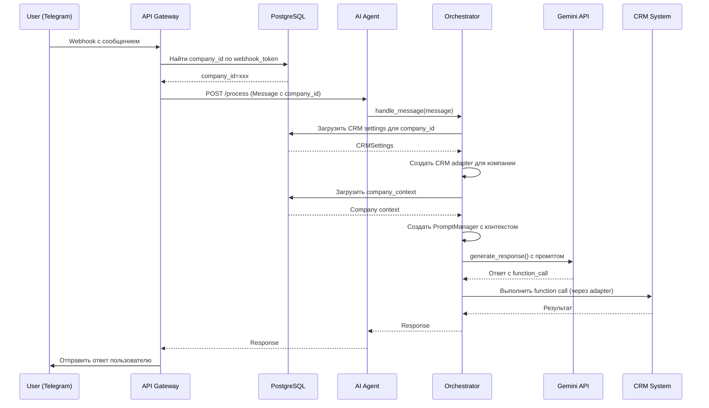

# AI-Admin: Архитектура системы

## Обзор

AI-Admin — это **multi-tenant SAAS платформа** для автоматизации клиентского сервиса через AI-агента. Система заменяет администраторов и операторов, обрабатывая входящие обращения через Telegram, WhatsApp и голосовые звонки.

## Ключевые принципы

### 1. Multi-tenant архитектура

**Каждая компания-клиент полностью изолирована:**
- Собственные настройки CRM
- Собственный каталог услуг и товаров
- Собственные промпты и инструкции для AI
- Собственные каналы коммуникации (webhooks)

**Идентификация компании:**
```
Webhook URL: https://api.ai-admin.ru/v1/telegram/webhook/{webhook_token}
                                                            ↑
                                                    Уникальный токен компании
```

### 2. Динамическая загрузка настроек

AI Agent **НЕ** имеет hardcoded настроек CRM. Для каждого сообщения:

```python
1. API Gateway получает webhook
2. Определяет company_id по webhook_token из БД
3. Создает Message с company_id
4. Orchestrator загружает настройки компании из PostgreSQL
5. Создает CRM адаптер динамически для этой компании
6. Обрабатывает сообщение с CRM конкретной компании
```

## Компоненты системы

### 1. API Gateway (FastAPI)

**Назначение:** Центральная точка входа для всех каналов коммуникации

**Responsibilities:**
- Прием webhooks от Telegram, WhatsApp
- Определение `company_id` по webhook токену
- Создание unified `Message` объекта
- Отправка сообщений в AI Agent
- (TODO) Отправка ответов пользователям

**Endpoints:**
```
POST /api/v1/telegram/webhook/{webhook_token}
POST /api/v1/whatsapp/webhook/{webhook_token}
GET  /health
```

**Multi-tenant flow:**
```python
async def telegram_webhook(webhook_token: str):
    # 1. Найти компанию по токену
    channel = await company_service.get_channel_by_token(webhook_token)
    company_id = channel.company_id

    # 2. Создать Message с company_id
    message = Message(
        company_id=company_id,
        channel=Channel.TELEGRAM,
        text=update["message"]["text"],
        ...
    )

    # 3. Отправить в AI Agent
    await ai_agent_client.post("/process", json=message.model_dump())
```

### 2. AI Agent (FastAPI + Orchestrator)

**Назначение:** Обработка диалогов с клиентами через LLM

**Архитектура:**
```
AI Agent
├── FastAPI App (app.py)
│   └── POST /process - прием сообщений
├── Orchestrator (core/orchestrator.py)
│   ├── Управление диалогами
│   ├── Загрузка настроек компании из БД
│   └── Создание CRM адаптеров динамически
├── GeminiService (services/gemini_service.py)
│   └── Интеграция с Google Gemini API
├── PromptManager (services/prompt_manager.py)
│   └── Системные промпты с контекстом компании
├── ToolManager (services/tool_manager.py)
│   └── Function calling для работы с CRM
└── RedisStorage (storage/redis_storage.py)
    └── Хранение сессий диалогов
```

**Multi-tenant Orchestrator:**
```python
class Orchestrator:
    def __init__(self, database_url):
        self.db = Database(database_url)
        self.gemini = GeminiService()
        self.storage = RedisStorage()
        # НЕТ глобального crm_adapter!

    async def handle_message(self, message: Message):
        # 1. Извлечь company_id
        company_id = message.company_id

        # 2. Загрузить настройки из БД
        async with self.db.session() as session:
            company_service = CompanyService(session)
            crm_settings = await company_service.get_crm_settings(company_id)
            company_context = await company_service.get_company_context(company_id)

            # 3. Создать CRM адаптер для ЭТОЙ компании
            crm_adapter = CRMFactory.create(
                crm_type=crm_settings.crm_type,
                api_key=crm_settings.api_key_encrypted,
                base_url=crm_settings.base_url
            )

            # 4. Создать инструменты для ЭТОЙ компании
            tool_manager = ToolManager(crm_adapter)
            prompt_manager = PromptManager(company_context)

            # 5. Обработать сообщение
            ...
```

### 3. Shared Package

**Назначение:** Общие модели и утилиты для всех сервисов

**Компоненты:**
- `models/` - Pydantic модели (Message, Session, CRM)
- `database/` - SQLAlchemy модели и connection manager
- `services/` - CompanyService для работы с БД

**Установка:**
```bash
pip install -e ./shared
```

### 4. CRM Integrations

**Назначение:** Модульные адаптеры для различных CRM

**Архитектура:**
```python
class BaseCRMAdapter(ABC):
    """Базовый интерфейс для всех CRM"""
    async def get_services() -> List[CRMService]
    async def get_available_slots() -> List[CRMSlot]
    async def get_client_by_phone() -> CRMClient
    async def create_appointment() -> CRMAppointment
    ...

class YCLIENTSAdapter(BaseCRMAdapter):
    """Адаптер для YCLIENTS CRM"""
    ...

class CRMFactory:
    @staticmethod
    def create(crm_type: str, api_key: str, base_url: str) -> BaseCRMAdapter:
        """Фабрика для создания CRM адаптеров"""
        if crm_type == "yclients":
            return YCLIENTSAdapter(api_key, base_url)
        ...
```

## База данных (PostgreSQL)

### Схема для multi-tenant

```sql
companies
├── id (UUID)
├── name
├── email
├── subscription_plan
└── ...

company_crm_settings
├── id (UUID)
├── company_id (FK → companies)
├── crm_type (yclients, dikidi, bitrix24, 1c)
├── api_key_encrypted
├── base_url
└── ...

company_agent_settings
├── id (UUID)
├── company_id (FK → companies)
├── company_description
├── business_type
├── services_catalog (JSONB)
├── products_catalog (JSONB)
├── business_highlights
├── working_hours
└── ...

company_channels
├── id (UUID)
├── company_id (FK → companies)
├── channel_type (telegram, whatsapp)
├── webhook_token (уникальный!)
├── is_active
└── ...

sessions
├── id (UUID)
├── company_id (FK → companies)
├── user_id
├── channel
├── state
└── ...

messages
├── id (UUID)
├── session_id (FK → sessions)
├── company_id (FK → companies)
├── text
└── ...
```

## Поток данных

### Входящее сообщение от пользователя



### Контекст компании в промптах

AI Agent **всегда** знает о компании:

```python
company_context = {
    "company_name": "Салон красоты Элита",
    "company_description": "Премиум салон красоты в центре Москвы",
    "business_type": "Салон красоты",
    "target_audience": "Женщины 25-50 лет, средний+ доход",

    "services_catalog": [
        {
            "name": "Стрижка женская",
            "description": "Стрижка любой сложности",
            "price": 2500,
            "duration": 60
        },
        {
            "name": "Окрашивание",
            "description": "Полное окрашивание волос премиум красками",
            "price": 8000,
            "duration": 180
        }
    ],

    "products_catalog": [
        {
            "name": "Шампунь Matrix",
            "description": "Профессиональный шампунь для окрашенных волос",
            "price": 1200
        }
    ],

    "business_highlights": "Мастера с опытом 10+ лет, используем только премиум материалы",
    "working_hours": "Пн-Пт 9:00-21:00, Сб-Вс 10:00-20:00",
    "address": "Москва, ул. Тверская, 15",
    "phone_display": "+7 (495) 123-45-67"
}
```

PromptManager формирует промпт:
```
=== ИНФОРМАЦИЯ О КОМПАНИИ ===
Название: Салон красоты Элита
Описание: Премиум салон красоты в центре Москвы
Тип бизнеса: Салон красоты
...

=== НАШИ УСЛУГИ ===
• Стрижка женская: Стрижка любой сложности (2500 руб.) - 60 мин
• Окрашивание: Полное окрашивание волос премиум красками (8000 руб.) - 180 мин

=== НАШИ ТОВАРЫ ===
• Шампунь Matrix: Профессиональный шампунь для окрашенных волос (1200 руб.)

=== КОНТАКТНАЯ ИНФОРМАЦИЯ ===
Часы работы: Пн-Пт 9:00-21:00, Сб-Вс 10:00-20:00
Адрес: Москва, ул. Тверская, 15
Телефон: +7 (495) 123-45-67
```

## Масштабируемость

### Horizontal Scaling

Каждый компонент можно масштабировать независимо:

```yaml
# Production deployment
services:
  api_gateway:
    replicas: 3  # Load balanced

  ai_agent:
    replicas: 5  # Heavy computation

  postgres:
    replicas: 1  # Primary-replica setup

  redis:
    replicas: 3  # Cluster mode
```

### Database Sharding

При росте до 10,000+ компаний:
- Шардирование по `company_id`
- Separate CRM adapters pools per shard
- Caching с Redis для hot companies

## Безопасность

1. **API Keys Encryption:**
   - CRM API ключи хранятся зашифрованными в БД
   - Расшифровка только в памяти Orchestrator

2. **Webhook Tokens:**
   - Уникальные токены для каждой компании
   - Валидация токена перед обработкой

3. **Rate Limiting:**
   - Per company rate limits
   - DDoS protection на уровне API Gateway

## Development vs Production

**Development (локальная разработка):**
- CRM settings можно задать через .env (для тестирования)
- Single-tenant режим для упрощения отладки

**Production:**
- Multi-tenant ВСЕГДА
- Настройки ТОЛЬКО в PostgreSQL
- Никаких CRM credentials в env vars

## Мониторинг

**Логирование:**
- Structured logging (JSON) через structlog
- Все логи содержат `company_id` для трейсинга

**Метрики:**
- Количество сообщений per company
- Latency per company
- CRM API call success rate
- Function calls analytics

**Алерты:**
- CRM API failures
- High latency (>5s)
- Database connection issues
